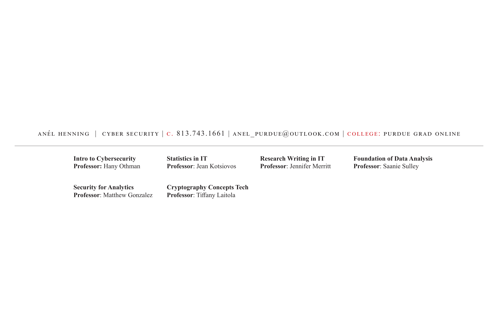

# Anél Henning — Purdue Global Portfolio

**Cybersecurity | Purdue Global University (Graduate Online)**

**Contact:** c. 813.743.1661 | anel_purdue@outlook.com

---

## Courses Represented in This Portfolio

| Course | Professor | Focus |
|---|---|---|
| Intro to Cybersecurity | Hany Othman | Security fundamentals |
| Security for Analytics | Matthew Gonzalez | Data-driven security |
| Statistics in IT | Jean Kotsiovos | Statistical methods, R-Studio |
| Cryptography Concepts Tech | Tiffany Laitola | Encryption, cryptographic systems |
| Research Writing in IT | Jennifer Merritt | Academic research writing |
| Foundation of Data Analysis | Saanie Sulley | R, ANOVA, regression, clustering |
| Quantitative Risk Analysis | Kevin Crouse | Risk modeling, GLM, decision trees |

---

