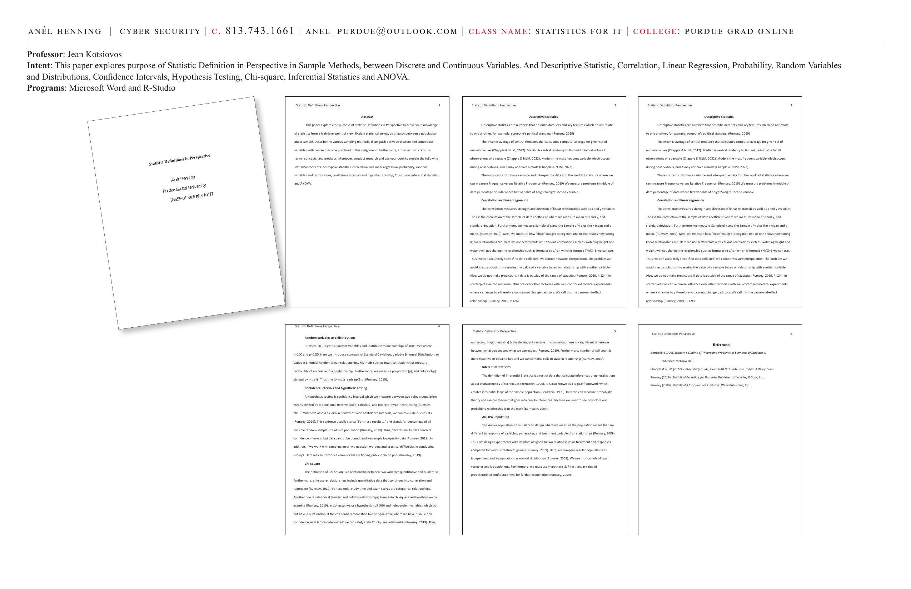
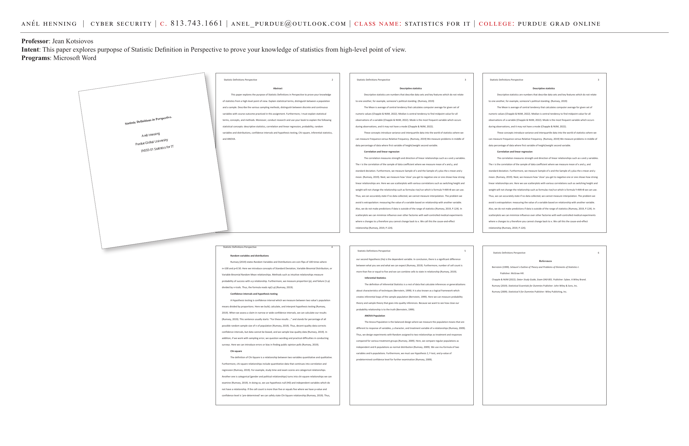

# Statistic Definitions in Perspective

**Course:** IN555-01 Statistics for IT | Purdue Global University
**Professor:** Jean Kotsiovos
**Programs:** Microsoft Word, R-Studio

**Intent:** This paper explores the purpose of Statistic Definitions in Perspective to prove knowledge of statistics from a high-level point of view — explaining statistical terms, distinguishing between a population and a sample, describing various sampling methods, and distinguishing between discrete and continuous variables.

---

---

## Abstract

This paper explores the purpose of Statistic Definitions in Perspective to prove knowledge of statistics from a high-level point of view. It explains statistical terms, distinguishes between a population and a sample, describes the various sampling methods, distinguishes between discrete and continuous variables with course outcome practiced in this assignment. Furthermore, it explains statistical terms, concepts, and methods. The following statistical concepts are covered: descriptive statistics, correlation and linear regression, probability, random variables and distributions, confidence intervals and hypothesis testing, Chi-square, inferential statistics, and ANOVA.

---

## Descriptive Statistics

Descriptive statistics are numbers that describe data sets and key features which do not relate to one another — for example, someone's political standing.

- **Mean:** Average of central tendency that calculates the computer average for a given set of numeric values (Chapple & NIJM, 2022).
- **Median:** Central tendency to find the midpoint value for all observations of a variable (Chapple & NIJM, 2022).
- **Mode:** The most frequent variable which occurs during observations — it may not have a mode (Chapple & NIJM, 2022).

These concepts introduce variance and interquartile data into the world of statistics where we can measure Frequency versus Relative Frequency.

---

## Correlation and Linear Regression

The correlation measures strength and direction of linear relationships such as x and y variables. The r is the correlation of the sample of data coefficient where we measure mean of x and y, and standard deviation. We measure how "close" you get to negative one or one — showing how strong linear relationships are. Scatterplots with various correlations use formulas rise/run which is formula Y=MX+B.

Key rules:
- If no data is collected, we cannot measure interpolation.
- We avoid extrapolation: measuring the value of a variable based on a relationship with another variable outside the range of data.
- In scatterplots we can minimize influence over other factors with well-controlled experiments where x changes to y — the cause-and-effect relationship (Rumsey, 2019, P.124).

---

## Random Variables and Distributions

Random Variables and Distributions are coin flips of 100 times where n=100 and p=0.50. Concepts include Standard Deviation, Variable Binomial Distribution, and Variable Binomial Random Mean relationships. Methods such as intuitive relationships measure probability of success with a p relationship. We measure proportion (p) and failure (1-p) divided by n-trials. The formula reads np(1-p) (Rumsey, 2019).

---

## Confidence Intervals and Hypothesis Testing

A Hypothesis test is a confidence interval which measures between two values — population means divided by proportions. We build, calculate, and interpret hypothesis testing. When we assess a claim in narrow or wide confidence intervals, we can calculate results. Decent-quality data corrects confidence intervals, but data cannot be biased. If working with sampling error, we question wording and practical difficulties in conducting surveys.

---

## Chi-Square

The definition of Chi-Square is a relationship between two variables — quantitative and qualitative. Chi-square relationships include quantitative data that continues into correlation and regression. Examples: study time and exam scores are categorical relationships; gender and political relationships are chi-square relationships. We use hypothesis null (H0) and independent variables. If the cell count is more than five or equals five where we have p-value and confidence level is "pre-determined," we can safely state a Chi-Square relationship (Rumsey, 2019).

---

## Inferential Statistics

The definition of Inferential Statistics is a test of data that calculates inferences or generalizations about characteristics of techniques (Bernstein, 1999). It is a logical framework which creates inferential leaps of the sample population. We measure probability theory and sample theory that goes into quality inferences.

---

## ANOVA Population

The ANOVA Population is the balanced design where we measure population means that are different in response of variables, y-character, and treatment variable of x-relationships. We design experiments with random assigned two relationships as treatment and responses compared for various treatment groups. We compare regular populations as independent and K-populations as normal distribution. We use the mu-formula of two variables and k-populations, and must use Hypothesis 2, F-test, and p-value of predetermined confidence level for further examination (Rumsey, 2009).

---

## References

- Bernstein (1999). *Schaum's Outline of Theory and Problems of Elements of Statistics I.* McGraw Hill.
- Chapple & NIJM (2022). *Data+ Study Guide, Exam DA0-001.* Sybex. A Wiley Brand.
- Rumsey (2019). *Statistical Essentials for Dummies.* John Wiley & Sons, Inc.
- Rumsey (2009). *Statistical II for Dummies.* Wiley Publishing, Inc.

---

**Skills:** Descriptive statistics · Correlation · Linear regression · Probability · ANOVA · Chi-square · R-Studio · Hypothesis testing · Inferential statistics
