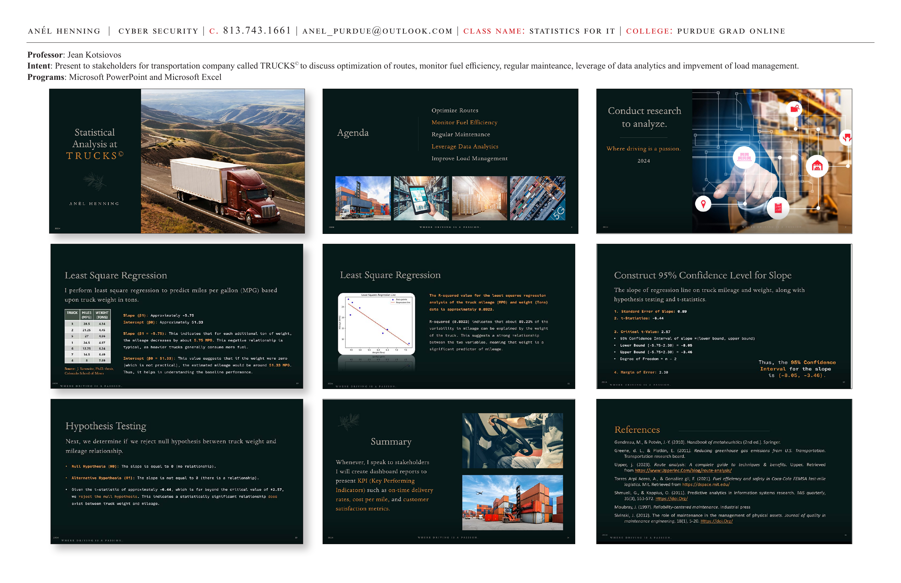

# Statistical Analysis at TRUCKS©

**Course:** IN555-01 Statistics for IT | Purdue Global University
**Professor:** Jean Kotsiovos
**Programs:** Microsoft PowerPoint, Microsoft Excel

**Intent:** Present to stakeholders for transportation company called TRUCKS© to discuss optimization of routes, monitor fuel efficiency, regular maintenance, leverage of data analytics, and improvement of load management.

---

---

## Business Context

This stakeholder presentation applies statistical analysis to a real-world transportation company scenario — TRUCKS© — to demonstrate how data analytics drives operational decisions across route optimization, fuel efficiency, maintenance scheduling, and load management.

---

## Agenda

1. Optimize Routes
2. Monitor Fuel Efficiency
3. Regular Maintenance
4. Leverage Data Analytics
5. Improve Load Management

*"Where driving is a passion."* — TRUCKS©, 2024

---

## Least Square Regression

Least square regression was performed to **predict miles per gallon (MPG) based upon truck weight in tons**.

**Dataset:**

| Truck | Miles (MPG) | Weight (Tons) |
|---|---|---|
| 1 | 26.1 | 4.24 |
| 2 | 21.25 | 4.41 |
| 3 | 17.45 | 5.22 |
| 4 | 24.3 | 4.97 |
| 5 | 11.75 | 5.24 |
| 6 | 14.5 | 6.49 |
| 7 | 18 | 7.69 |

**Results:**
- **Slope (β1):** Approximately **-5.75** — For each additional ton of weight, mileage decreases by about 5.75 MPG. This negative relationship is typical, as heavier trucks generally consume more fuel.
- **Intercept (β0):** Approximately **51.33** — If the weight values were zero (not practical), the estimated mileage would be around 51.33 MPG. This helps understand the baseline performance.

---

## R-Squared and Regression Analysis

The **R-squared value** for the least squares regression analysis of truck mileage (MPG) and weight (Tons) data is approximately **0.8022**.

**R-squared (0.8022)** indicates that about **80.22%** of the variability in mileage can be explained by the weight of the truck. This suggests a **strong relationship** between the two variables, meaning weight is a significant predictor of mileage.

---

## 95% Confidence Interval for Slope

The slope of the regression line on truck mileage and weight, along with hypothesis testing and t-statistics:

1. **Standard Error of Slope:** 0.89
2. **t-Statistic:** -6.44
3. **Critical t-Value:** 2.57
4. **95% Confidence Interval of slope (lower bound, upper bound):**
   - Lower Bound: (-5.75 - 2.30) = **-8.05**
   - Upper Bound: (-5.75 + 2.30) = **-3.46**
5. **Degrees of Freedom:** n - 2
6. **Margin of Error:** 2.30

**Thus, the 95% Confidence Interval for the slope is (-8.05, -3.46).**

---

## Hypothesis Testing

To determine if we reject the null hypothesis between truck weight and mileage relationship:

- **Null Hypothesis (H0):** The slope is equal to 0 (no relationship).
- **Alternative Hypothesis (H1):** The slope is not equal to 0 (there is a relationship).

Given the t-statistic of approximately **-6.44**, which is far beyond the critical value of ±2.57, we **reject the null hypothesis**. This indicates a statistically significant relationship does exist between truck weight and mileage.

---

## Summary

Whenever presenting to stakeholders, dashboard reports will present KPIs (Key Performing Indicators) such as:
- **On-time delivery rates**
- **Cost per mile**
- **Customer satisfaction metrics**

---

## References

- Gendreau, M., & Potvin, J.-Y. (2010). *Handbook of metaheuristics* (2nd ed.). Springer.
- Greene, D. L., & Plotkin, E. (2011). *Reducing greenhouse gas emissions from U.S. Transportation.* Transportation Research Board.
- Upper, J. (2023). Route analysis: A complete guide to techniques & benefits. https://www.upperinc.com/blog/route-analysis/
- Torres Arpi Acero, A., & González Gil, F. (2021). Fuel efficiency and safety in Coca-Cola FEMSA last-mile logistics. MIT. https://dspace.mit.edu/
- Shmueli, G., & Koppius, O. (2011). Predictive analytics in information systems research. *MIS Quarterly, 35*(3), 553–572.
- Moubray, J. (1997). *Reliability-centered maintenance.* Industrial Press.
- Sivinski, J. (2012). The role of maintenance in the management of physical assets. *Journal of Quality in Maintenance Engineering, 18*(1), 5–20.

---

**Skills:** Least squares regression · R-squared analysis · Hypothesis testing · Confidence intervals · Stakeholder presentations · Microsoft PowerPoint · Microsoft Excel · Transportation analytics
