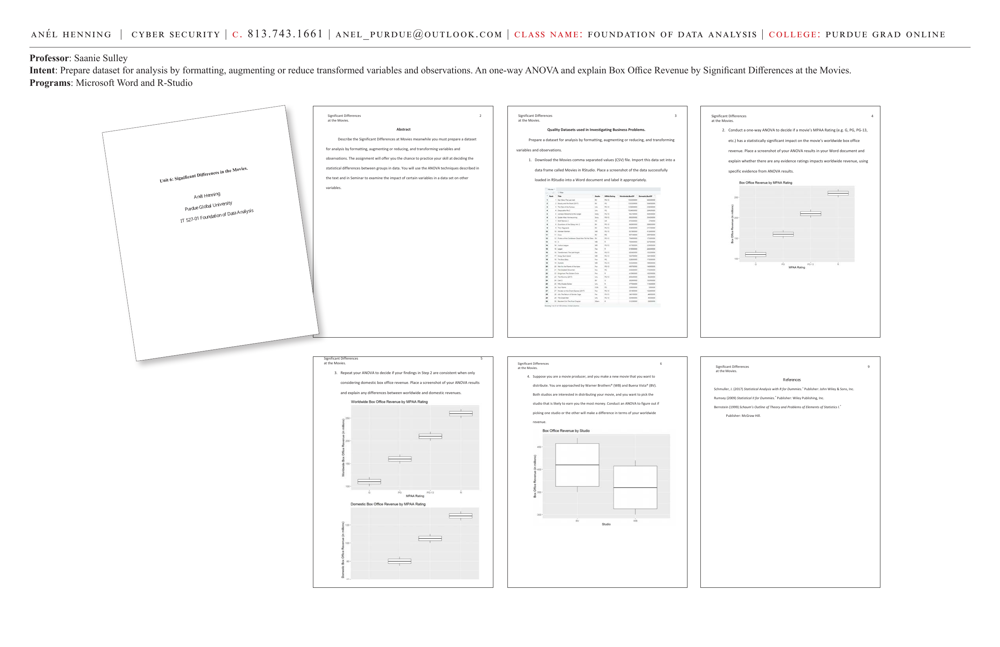

# Significant Differences at the Movies

**Course:** IT 527-01 Foundation of Data Analysis | Purdue Global University
**Professor:** Saanie Sulley
**Programs:** Microsoft Word, R-Studio

**Intent:** Prepare a dataset for analysis by formatting, augmenting or reducing, and transforming variables and observations. Conduct a one-way ANOVA and explain Box Office Revenue by Significant Differences at the Movies.

---

---

## Abstract

This assignment describes Significant Differences at the Movies. It prepares a dataset for analysis by formatting, augmenting or reducing, and transforming variables and observations. The assignment offers the chance to practice the skill of deciding statistical differences between groups in data — using ANOVA techniques to examine the impact of certain variables on box office revenue.

---

## Quality Datasets Used in Investigating Business Problems

Prepare a dataset for analysis by formatting, augmenting or reducing, and transforming variables and observations.

### Step 1: Import Movies Dataset
Download the Movies comma separated values (CSV) file. Import this dataset into a data frame called `Movies` in RStudio. Place a screenshot of the data successfully loaded in RStudio into a Word document and label it appropriately.

---

## Step 2: One-Way ANOVA — MPAA Rating vs. Worldwide Revenue

Conduct a one-way ANOVA to decide if a movie's MPAA Rating (e.g., G, PG, PG-13, etc.) has a statistically significant impact on the movie's worldwide box office revenue.

**Finding:** The ANOVA results provide evidence on whether ratings impact worldwide revenue. The box plot of Box Office Revenue by MPAA Rating shows the distribution of worldwide revenue across rating categories.

---

## Step 3: Domestic vs. Worldwide Revenue ANOVA

Repeat the ANOVA to decide if findings from Step 2 are consistent when only considering domestic box office revenue.

**Findings:**
- **Worldwide Box Office Revenue by MPAA Rating** — Shows variation across rating groups globally.
- **Domestic Box Office Revenue by MPAA Rating** — Compared to worldwide results to identify differences between domestic and international performance.

---

## Step 4: Warner Brothers vs. Buena Vista Revenue Analysis

As a movie producer wanting to distribute a new movie, conduct an ANOVA to figure out if picking Warner Brothers (WB) or Buena Vista (BV) will make a difference in terms of worldwide revenue.

The **Box Office Revenue by Studio** boxplot shows the distribution of worldwide revenue by studio. The ANOVA determines whether the difference between studios is statistically significant.

---

## References

- Schmuller, J. (2017). *Statistical Analysis with R for Dummies.* John Wiley & Sons, Inc.
- Rumsey (2009). *Statistical II for Dummies.* Wiley Publishing, Inc.
- Bernstein (1999). *Schaum's Outline of Theory and Problems of Elements of Statistics I.* McGraw Hill.

---

**Skills:** One-way ANOVA · R-Studio · Dataset formatting · Box plots · Hypothesis testing · Box office revenue analysis · Worldwide vs. domestic comparisons · Statistical significance
