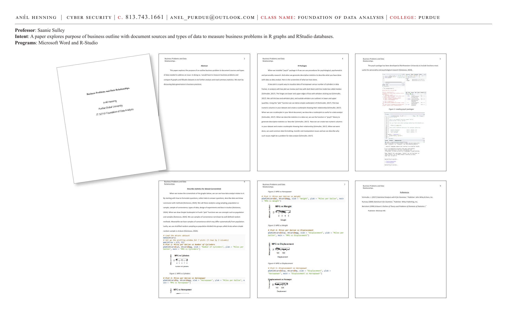

# Business Problems and Data Relationships

**Course:** IT 527-01 Foundation of Data Analysis | Purdue Global University
**Professor:** Saanie Sulley
**Programs:** Microsoft Word, R-Studio

**Intent:** A paper exploring the purpose of a business outline with document sources and types of data to measure business problems using R graphs and RStudio databases.

---



---

## Abstract

This paper explores the purpose of an outline business problem to document sources and types of data needed to address an issue. It measures business problems and compares R graphs and RStudio datasets for further analysis and reads summary statistics. The paper begins by discussing data governance in business practices.

---

## R Packages

When the `psych` package is installed in R, it provides procedures for psychological, psychometric, and personality research — and generates descriptive statistics to describe what was done with data as a data analyst.

> "The psych package has been developed at Northwestern University to include functions most useful for personality and psychological research." — Kotsiovos, 2024

**Box plots** are a quick way to visualize data of horsepower versus number of cylinders in data frames. In analysis with a box plot:
- Each box has a dark solid line inside called the **median** (Schmuller, 2017).
- The hinges are the lower and upper edges of the box with whiskers sticking out.
- This is called a **box-and-whiskers plot** — outside whiskers are outliers in lower and upper quartiles.

---

## R Code: Loading and Plotting the `mtcars` Dataset

```r
# Load the mtcars dataset
data(mtcars)

# Set up the plotting window for 7 plots (3 rows by 3 columns)
par(mfrow = c(3, 3))

# Plot 1: Miles per Gallon vs Number of Cylinders
plot(mtcars$cyl, mtcars$mpg,
     xlab = "Number of Cylinders",
     ylab = "Miles per Gallon",
     main = "MPG vs Cylinders")

# Plot 2: Miles per Gallon vs Horsepower
plot(mtcars$hp, mtcars$mpg,
     xlab = "Horsepower",
     ylab = "Miles per Gallon",
     main = "MPG vs Horsepower")

# Plot 3: Miles per Gallon vs Weight
plot(mtcars$wt, mtcars$mpg,
     xlab = "Weight",
     ylab = "Miles per Gallon",
     main = "MPG vs Weight")

# Plot 4: Miles per Gallon vs Displacement
plot(mtcars$disp, mtcars$mpg,
     xlab = "Displacement",
     ylab = "Miles per Gallon",
     main = "MPG vs Displacement")

# Plot 5: Displacement vs Horsepower
plot(mtcars$disp, mtcars$hp,
     xlab = "Displacement",
     ylab = "Horsepower",
     main = "Displacement vs Horsepower")
```

---

## Describing Statistics for the Dataset

When reviewing the graphs, we can see how data analysis relates to business problems. By starting with how to formulate questions and collect data to answer them, we use analytics involving sampling, population vs. sample, sample of convenience, types of data, design of experiments, and bias in studies (Kotsiovos, 2024).

**Key concepts applied:**
- **Population vs. Sample:** Samples of convenience may differ systematically from the population.
- **Stratified Random Sampling:** Population divided into groups called strata where a simple random sample is drawn from each stratum.
- Using the `plot` function in R to demo simple scatterplots and show relationships between numeric columns in the dataset.

---

## References

- Schmuller, J. (2017). *Statistical Analysis with R for Dummies.* John Wiley & Sons, Inc.
- Rumsey (2009). *Statistical II for Dummies.* Wiley Publishing, Inc.
- Bernstein (1999). *Schaum's Outline of Theory and Problems of Elements of Statistics I.* McGraw Hill.

---

**Skills:** R programming · mtcars dataset · Scatterplots · Box plots · Descriptive statistics · Sampling methods · Data governance · `psych` package · Business analytics
