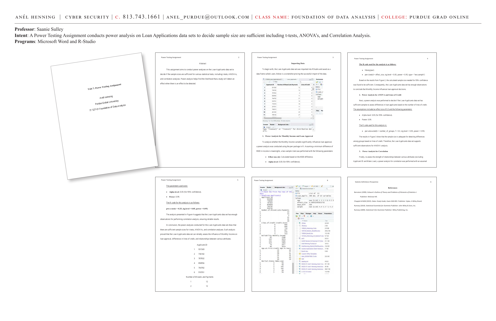

# Power Testing Assignment

**Course:** IT 527-01 Foundation of Data Analysis | Purdue Global University
**Professor:** Saanie Sulley
**Programs:** Microsoft Word, R-Studio

**Intent:** A Power Testing Assignment that conducts power analysis on Loan Applications datasets to decide if sample sizes are sufficient — including t-tests, ANOVAs, and Correlation Analysis.

---



---

## Abstract

This assignment conducts power analyses on the Loan Applicants dataset to decide if the sample sizes are sufficient for various statistical tests, including t-tests, ANOVAs, and correlation analyses. Power analysis helps find the likelihood that a study will detect an effect when there is an effect to be detected.

---

## Importing Data

The Loan Applicants dataset was imported into RStudio and saved as a data frame called `Loans`.

---

## 1. Power Analysis for Monthly Income and Loan Approval

To analyze whether the Monthly Income variable significantly influences loan approval, a power analysis was conducted using the `pwr` package in R. Assuming a minimum difference of $500 in income is meaningful, a two-sample t-test was performed with the following parameters:

- **Effect size (d):** Calculated based on the $500 difference.
- **Alpha level:** 0.05 (for 95% confidence).

**R Code:**
```r
library(pwr)
pwr.t.test(d = effect_size, sig.level = 0.05, power = 0.95, type = "two.sample")
```

**Finding:** Based on the results, the calculated sample size needed for 95% confidence was found to be sufficient. Consequently, the Loan Applicants dataset has enough observations to conclude that Monthly Income influences loan approval decisions.

---

## 2. Power Analysis for ANOVA and Lines of Credit

A power analysis was performed to decide if the Loan Applicants dataset has sufficient samples to assess differences in loan applicants based on the number of lines of credit.

- **Effect size:** 0.3
- **Alpha level:** 0.05 (for 95% confidence).
- **Power:** 0.99.

**R Code:**
```r
pwr.anova.test(k = number_of_groups, f = 0.3, sig.level = 0.05, power = 0.95)
```

**Finding:** The sample size is adequate for detecting differences among groups based on lines of credit. The Loan Applicants dataset supports sufficient observations for ANOVA analysis.

---

## 3. Power Analysis for Correlation

To assess the strength of relationships between various attributes (excluding Applicant ID and Make Loan), a power analysis for correlation was performed with an assumed effect size.

**Parameters used:**
- Alpha level: 0.05 (for 95% confidence).
- Power: 0.99.

**R Code:**
```r
pwr.r.test(r = 0.25, sig.level = 0.05, power = 0.95)
```

**Finding:** The Loan Applicants dataset has enough observations for performing correlation analysis, ensuring reliable results.

---

## Conclusion

The power analyses conducted for the Loan Applicants dataset show that there are sufficient sample sizes for t-tests, ANOVAs, and correlation analyses. Each analysis proved that the Loan Applicants dataset can reliably assess:
- The influence of Monthly Income on loan approval.
- Differences in lines of credit.
- Relationships between various attributes.

---

## Sample Data Output

```
Applicant.ID
1       931569
2       736182
3       787832
4       858956
5       764782
6       918761

Number.of.Missed.Late.Payments
1                             12
2                             12
```

---

## References

- Schmuller, J. (2017). *Statistical Analysis with R for Dummies.* John Wiley & Sons, Inc.
- Rumsey (2009). *Statistical II for Dummies.* Wiley Publishing, Inc.
- Bernstein (1999). *Schaum's Outline of Theory and Problems of Elements of Statistics I.* McGraw Hill.

---

**Skills:** Power analysis · t-tests · ANOVA · Pearson correlation · `pwr` package in R · Loan risk datasets · Sample size determination · Statistical significance
