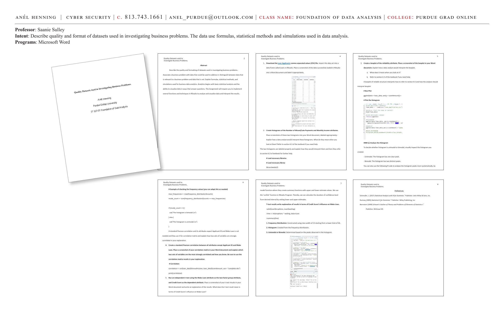

# Quality Datasets Used to Investigate Business Problems

**Course:** IT 527-01 Foundation of Data Analysis | Purdue Global University
**Professor:** Saanie Sulley
**Programs:** Microsoft Word, R-Studio

**Intent:** Describe the quality and format of datasets used in investigating business problems. The data uses formulas, statistical methods, and simulations used in data analysis.

---



---

## Abstract

Describe the quality and formatting of datasets used in investigating business problems. Associate a business problem with data that could be used to address it. Distinguish between data that is relevant to a business problem and data that is not. Explain formulas, statistical methods, and simulations used for business data analytics. Analytics begins with basic statistical analysis and the ability to visualize data in ways that answer questions. This assignment implements several functions and techniques in RStudio to analyze, visualize, and interpret data.

---

## Step 1: Import the Loan Applicants Dataset

Download the Loan Applicants comma separated values (CSV) file. Import this dataset into a data frame called `Loans` in RStudio:

```r
# Load necessary library
library(ggplot2)

loans <- read.csv("LoanApplicants.csv")
```

---

## Step 2: Histograms — Missed/Late Payments and Monthly Income

Create histograms of the **Number of Missed/Late Payments** and **Monthly Income** attributes. These histograms show how a data analyst would interpret these distributions:

- Refer to section 6.3 of the textbook for interpretation guidance.
- The two histograms are labeled properly and explain how they would be interpreted.

---

## Step 3: Boxplot of the Reliability Attribute

Create a boxplot of the reliability attribute. Explain how a data analyst would interpret the boxplot:

a. **What it means when you look at it:**
   - A boxplot of reliable structure interprets how to refer to section 6.5 and how the analysis should interpret it.

b. **R Code:**
```r
# Box Plot
ggplot(data = loan_data, aes(y = LoanAmount)) +
  geom_boxplot()
```

**Analyzing the Histogram:**
To decide whether a histogram is unimodal or bimodal, visually inspect the histogram:
- **Unimodal:** The histogram has one clear peak.
- **Bimodal:** The histogram has two distinct peaks.

```r
# Check the frequency values
max_frequencies <- max(frequency_distribution$counts)
mode_count <- sum(frequency_distribution$counts == max_frequencies)

if (mode_count > 1) {
  cat("The histogram is bimodal.\n")
} else {
  cat("The histogram is unimodal.\n")
}
```

---

## Step 4: Pearson Correlation Matrix

Create a standard Pearson correlation between all attributes except Applicant ID and Make Loan. Explain which two sets of variables are the most strongly correlated:

```r
# Correlation
correlation <- cor(loan_data$AnnualIncome, loan_data$LoanAmount, use = "complete.obs")
print(correlation)
```

A standard Pearson correlation and its attributes — except Applicant ID and Make Loan — are used for the correlation matrix to explain how two sets of variables are strongly correlated.

---

## Step 5: Independent T-Test — Credit Score vs. Make Loan

Run an independent t-test using the **Make Loan** attribute as the two-factor group attribute, and **Credit Score** as the dependent attribute.

**Model function:**
Where they create summary functions with upper and lower estimate values. We use the `confint` function in RStudio to calculate the duration of confidence level from derived interval by setting lower and upper estimates.

```r
plot(Loan$eruptions, Loan$waiting)
lme <- lm(eruptions ~ waiting, data = Loan)
summary(lme)
```

**Results Summary:**
1. **Frequency Distribution:** Constructed using class width of 15 starting from a lower limit of 30.
2. **Histogram:** Created from the frequency distribution.
3. **Unimodal or Bimodal:** Determined based on the peaks observed in the histogram.

---

## References

- Schmuller, J. (2017). *Statistical Analysis with R for Dummies.* John Wiley & Sons, Inc.
- Rumsey (2009). *Statistical II for Dummies.* Wiley Publishing, Inc.
- Bernstein (1999). *Schaum's Outline of Theory and Problems of Elements of Statistics I.* McGraw Hill.

---

**Skills:** Dataset quality assessment · Histograms · Boxplots · Pearson correlation · Independent t-test · ggplot2 · Frequency distributions · Loan applicant data · R-Studio
