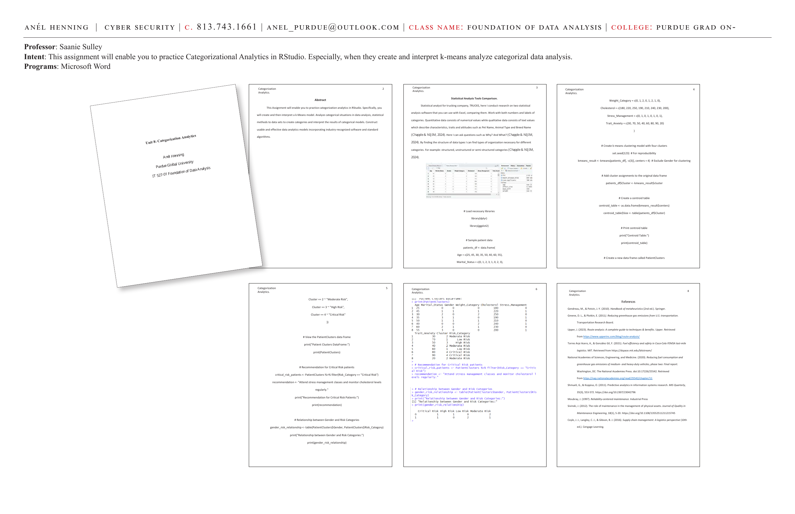
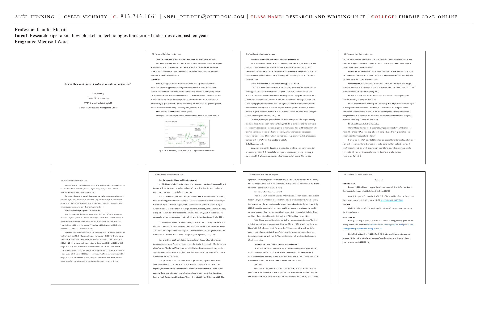

# Categorization Analytics — k-Means Clustering

**Course:** IT 527-01 Foundation of Data Analysis | Purdue Global University
**Professor:** Saanie Sulley
**Programs:** Microsoft Word, R-Studio

**Intent:** This assignment enables practice of Categorization Analytics in RStudio — specifically creating and interpreting a k-Means model, analyzing categorical situations in data analysis, and applying statistical methods to datasets to create categories and interpret results of categorical models.

---




---

## Abstract

This assignment enables practice of categorization analytics in RStudio. Specifically, creating and interpreting a k-Means model. Analyzing categorical situations in data analysis, statistical methods applied to datasets to create categories and interpret the results of categorical models. Constructing usable and effective data analytics models incorporating industry-recognized software and standard algorithms.

---

## Statistical Analysis Tools Comparison

As a statistical analyst for trucking company TRUCKS, research was conducted on two statistical analysis software tools that can be used with Excel — comparing them. Work with both numbers and labels of categories.

- **Quantitative data:** Consists of numerical values.
- **Qualitative data:** Consists of text values which describe characteristics, traits, and attitudes such as Pet Name, Animal Type, and Breed Name (Chapple & NIJIM, 2024).

Questions we ask: **Why?** and **What?** (Chapple & NIJIM, 2024)

By finding the structure of data types, we can find types of organization necessary for different categories:
- Structured
- Unstructured
- Semi-structured

---

## Sample Patient Data for k-Means Clustering

```r
# Load necessary libraries
library(dplyr)
library(ggplot2)

# Sample patient data
patients_df <- data.frame(
  Age = c(25, 45, 30, 35, 50, 40, 60, 55),
  Marital_Status = c(0, 1, 2, 3, 1, 0, 2, 3),
  Weight_Category = c(0, 1, 2, 0, 1, 2, 1, 0),
  Cholesterol = c(180, 220, 250, 190, 210, 240, 230, 200),
  Stress_Management = c(0, 1, 0, 1, 0, 1, 0, 1),
  Trait_Anxiety = c(30, 70, 50, 40, 60, 80, 90, 20)
)
```

---

## k-Means Clustering Model — 4 Clusters

```r
# Create k-means clustering model with four clusters
set.seed(123)  # For reproducibility
kmeans_result <- kmeans(patients_df[, -c(3)], centers = 4)  # Exclude Gender for clustering

# Add cluster assignments to the original data frame
patients_df$Cluster <- kmeans_result$cluster

# Create a centroid table
centroid_table <- as.data.frame(kmeans_result$centers)
centroid_table$Size <- table(patients_df$Cluster)

# Print centroid table
print("Centroid Table:")
print(centroid_table)
```

---

## Creating the PatientClusters Data Frame

```r
# Create a new data frame called PatientClusters
PatientClusters <- patients_df %>%
  mutate(Risk_Category = case_when(
    Cluster == 1 ~ "Low Risk",
    Cluster == 2 ~ "Moderate Risk",
    Cluster == 3 ~ "High Risk",
    Cluster == 4 ~ "Critical Risk"
  ))

# View the PatientClusters data frame
print("Patient Clusters DataFrame:")
print(PatientClusters)

# Recommendation for Critical Risk patients
critical_risk_patients <- PatientClusters %>% filter(Risk_Category == "Critical Risk")
recommendation <- "Attend stress management classes and monitor cholesterol levels regularly."
print("Recommendation for Critical Risk Patients:")
print(recommendation)

# Relationship between Gender and Risk Categories
gender_risk_relationship <- table(PatientClusters$Gender, PatientClusters$Risk_Category)
print("Relationship between Gender and Risk Categories:")
print(gender_risk_relationship)
```

---

## Results: Patient Risk Categories

| Patient | Age | Cluster | Risk Category |
|---|---|---|---|
| 1 | 25 | 1 | Low Risk |
| 2 | 45 | 3 | High Risk |
| 3 | 30 | 2 | Moderate Risk |
| 4 | 35 | 1 | Low Risk |
| 5 | 50 | 4 | Critical Risk |
| 6 | 40 | 3 | High Risk |
| 7 | 60 | 4 | Critical Risk |
| 8 | 55 | 2 | Moderate Risk |

**Recommendation for Critical Risk Patients:** Attend stress management classes and monitor cholesterol levels regularly.

---

## Relationship Between Gender and Risk Categories

```
[1] "Relationship between Gender and Risk Categories:"
   Critical Risk  High Risk  Low Risk  Moderate Risk
0             1          1         1              1
1             1          1         1              1
```

---

## References

- Gendreau, M., & Potvin, J.-Y. (2010). *Handbook of metaheuristics* (2nd ed.). Springer.
- Greene, D. L., & Plotkin, E. (2011). *Reducing greenhouse gas emissions from U.S. Transportation.* Transportation Research Board.
- Upper, J. (2023). Route analysis: A complete guide to techniques & benefits. https://www.upperinc.com/blog/route-analysis/
- Torres Arpi Acero, A., & González Gil, F. (2021). Fuel efficiency and safety in Coca-Cola FEMSA last-mile logistics. MIT. https://dspace.mit.edu/
- Shmueli, G., & Koppius, O. (2011). Predictive analytics in information systems research. *MIS Quarterly, 35*(3), 553–572.
- Moubray, J. (1997). *Reliability-centered maintenance.* Industrial Press.
- Sivinski, J. (2012). The role of maintenance in the management of physical assets. *Journal of Quality in Maintenance Engineering, 18*(1), 5–20.
- Coyle, J. J., Langley, C. J., & Gibson, B. J. (2016). *Supply chain management: A logistics perspective* (10th ed.). Cengage Learning.

---

**Skills:** k-Means clustering · R programming · Categorical analytics · Risk categorization · dplyr · ggplot2 · Patient data analysis · Centroid tables · Healthcare analytics
