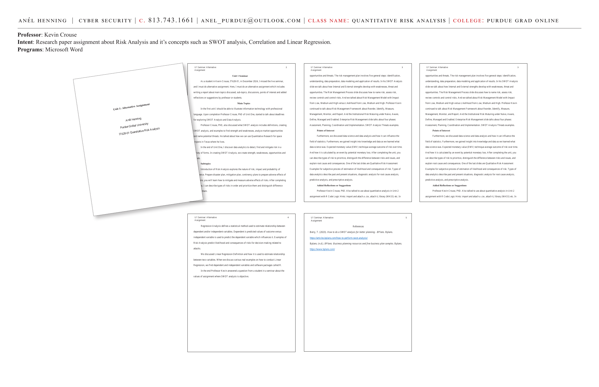
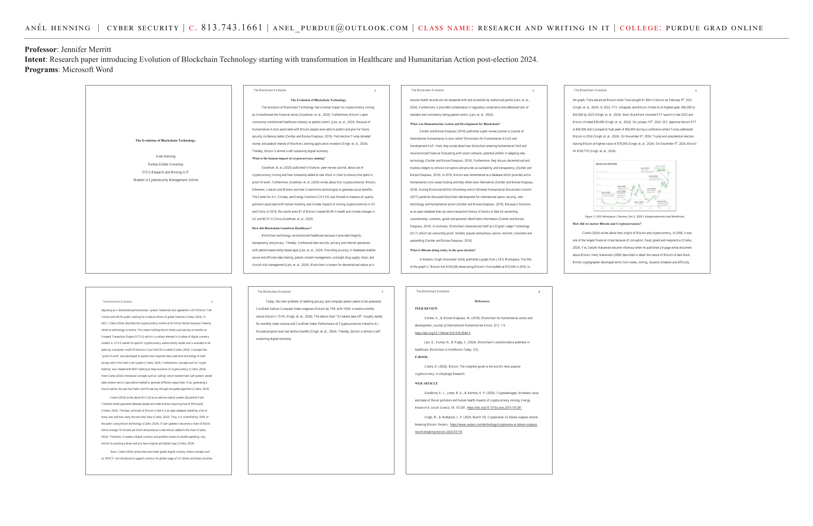

# Unit 1: Risk Analysis — Alternative Assignment (Seminar Reflection)

**Course:** IT628-01 Quantitative Risk Analysis | Purdue Global University
**Professor:** Kevin Crouse, PhD
**Programs:** Microsoft Word

**Intent:** Research paper assignment about Risk Analysis and its concepts such as SWOT analysis, Correlation, and Linear Regression.

---

---

## Unit 1 Seminar

As a student in Kevin Crouse, IT628-01, in December 2024, I missed the live seminar and completed an alternative assignment — writing a report about main topics discussed, sub-topics, discussions, points of interest, and added reflections or suggestions by the professor and students.

---

## Main Topics

In the first unit, illustrating information technology with professional language is a key goal. Upon completion, Professor Crouse, PhD of Unit One started to talk about deadlines for exploring **SWOT Analysis** and **Data Analysis**.

Professor Crouse also discussed what SWOT analysis includes:
- Definitions, creating SWOT analysis, and examples to find strength and weaknesses
- Analyze market opportunities and name potential threats
- How Quantitative Research can be used for space projects in Texas where he lives

In the end of Unit One, data analytics is used to detect, find, and mitigate risk in a variety of forms. In creating SWOT Analysis, we create strength, weaknesses, opportunities, and threats.

---

## Subtopics

**Introduction of Risk Analysis** explores the nature of risk, impact, and probability of occurrence. Prepare disaster plan, mitigation plan, contingency plans to prepare adverse effects of risk. You will learn how to mitigate and measure adverse effects of risks.

After completing Unit One, I can:
- Describe types of risks in order and prioritize them
- Distinguish the difference between risks and issues
- Explain root cause and consequences

---

## Points of Interest

We discussed data science and data analysis and how it can influence the field of statistics. Expected monetary value (EMV) technique — average outcome of risk over time. EMV is calculated by an event by potential monetary loss.

After completing the unit, you can:
- Describe types of risk to prioritize
- Distinguish the difference between risks and issues
- Explain root cause and consequences

**Types of data analytics:**
- Descriptive analysis — describes past and present situations
- Diagnostic analysis — for root cause analysis
- Predictive analysis
- Prescriptive analysis

**Risk Management Model:** Impact from Low, Medium, and High versus Likelihood from Low, Medium, and High.

**Risk Management Framework:** Reorder, Identify, Measure, Management, Monitor, and Report.

**Institutional Risk Maturity:** Naïve → Aware → Define → Managed → Enabled.

**Enterprise Risk Management** — four phases: Assessment, Planning, Coordination, and Implementation.

---

## Risk Management Process

The **Risk Management Plan** involves five general steps:
1. Identification
2. Understanding
3. Data preparation
4. Data modeling
5. Application of results

In the SWOT Analysis slide, Internal and External strengths develop with weaknesses, threats, and opportunities. The Risk Management Process slide discusses how to name risk, assess risk, review controls, and control risks.

---

## Regression Analysis

Regression Analysis defines a statistical method used to estimate the relationship between dependent and/or independent variables.

- **Dependent variable:** Predicted values of outcome
- **Independent variable:** Used to predict the dependent variable, which influences it

Examples of Risk Analysis predict likelihood and consequences of risks for decision-making related to attacks.

**Linear Regression** is used to estimate the relationship between two variables. When discussing various real examples on how to conduct Linear Regression, we find dependent and independent variables and software packages called R.

---

## Added Reflections or Suggestions

Professor Kevin Crouse, PhD also talked about quantitative analysis in Unit 2 assignment with **R Code Logic Hints:**
- Import and attach a `.csv`
- Attach it
- `library(MASS)` etc.

---

## References

- Berry, T. (2023). How to do a SWOT analysis for better planning. BPlans. https://articles.bplans.com/how-to-perform-swot-analysis/
- BPlans. (n.d.). BPlans: Business planning resources and free business plan samples. https://www.bplans.com/

---

**Skills:** SWOT analysis · Risk identification · Risk management frameworks · Linear regression · Descriptive/diagnostic/predictive analytics · EMV · Qualitative risk assessment · Enterprise risk management
