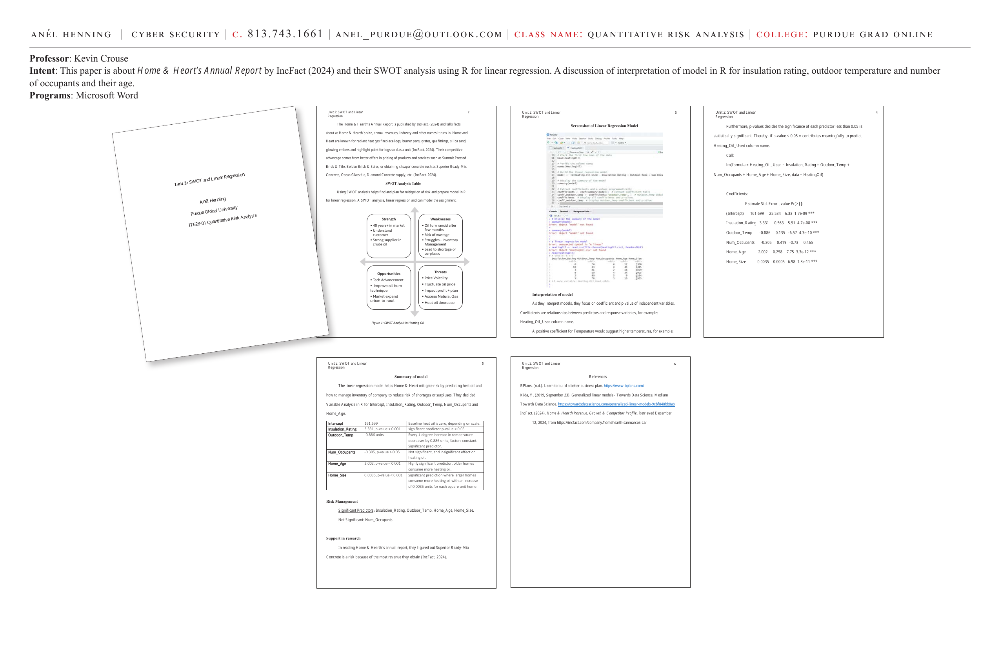
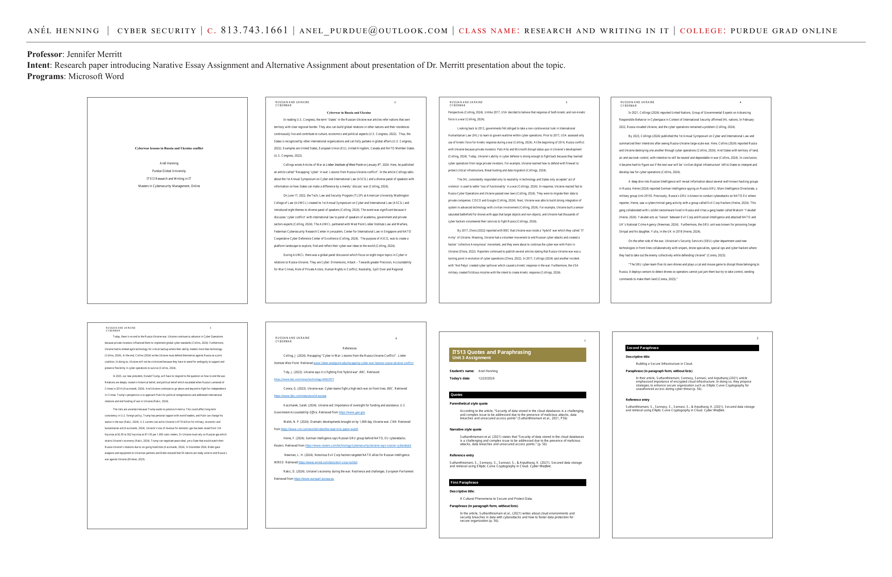

# Unit 2: SWOT Analysis and Linear Regression — Home & Hearth

**Course:** IT628-01 Quantitative Risk Analysis | Purdue Global University
**Professor:** Kevin Crouse, PhD
**Programs:** Microsoft Word, R-Studio

**Intent:** This paper is about Home & Heart's Annual Report by IncFact (2024) and their SWOT analysis using R for linear regression. A discussion of interpretation of the model in R for insulation rating, outdoor temperature, number of occupants, and home age.

---




---

## Home & Hearth Company Overview

The Home & Hearth Annual Report is published by IncFact (2024) and provides facts about Home & Hearth's size, annual revenues, industry, and other names it operates under. Home and Hearth are known for:
- Radiant heat gas fireplace logs
- Burner pans, grates, gas fittings, silica sand
- Glowing embers and highlight paint for logs sold as a unit (IncFact, 2024)

Their competitive advantage comes from better pricing of products and services such as Summit Pressed Brick & Tile, Belden Brick & Sales, or obtaining cheaper concrete such as Superior Ready-Mix Concrete, Ocean Glass Tile, Diamond Concrete Supply, etc.

---

## SWOT Analysis — Heating Oil

Using SWOT analysis helps find and plan for mitigation of risk and prepare the model in R for linear regression.

| | |
|---|---|
| **Strengths** | 40+ years in market · Understand customer · Strong supplier in crude oil |
| **Weaknesses** | Oil turns rancid after a few months · Risk of wastage · Struggles with inventory management · Lead to shortage or surpluses |
| **Opportunities** | Tech advancement · Improve oil-burn technique · Market expansion urban-to-rural |
| **Threats** | Price volatility · Fluctuating oil prices · Impact profit + plan · Access to Natural Gas · Heat oil decrease |

---

## Linear Regression Model in R

```r
lm(formula = Heating_Oil_Used ~ Insulation_Rating + Outdoor_Temp +
   Num_Occupants + Home_Age + Home_Size, data = HeatingOil)
```

**Coefficients:**

```
                  Estimate  Std. Error  t value   Pr(>|t|)
(Intercept)       161.699    25.534      6.33      1.7e-09 ***
Insulation_Rating   3.331     0.563      5.91      4.7e-08 ***
Outdoor_Temp       -0.886     0.135     -6.57      4.3e-10 ***
Num_Occupants      -0.305     0.419     -0.73      0.465
Home_Age            2.002     0.258      7.75      3.3e-12 ***
Home_Size           0.0035    0.0005     6.98      1.8e-11 ***
```

**p-values decide the significance of each predictor:** If p-value < 0.05, the variable contributes meaningfully to predict `Heating_Oil_Used`.

---

## Interpretation of Model

| Variable | Estimate | Interpretation |
|---|---|---|
| **Intercept** | 161.699 | Baseline heating oil when all predictors are zero |
| **Insulation_Rating** | 3.331, p < 0.001 | Significant predictor |
| **Outdoor_Temp** | -0.886 | Every 1-degree increase in temperature decreases heating oil by 0.886 units. Significant predictor. |
| **Num_Occupants** | -0.305, p > 0.05 | Not significant — insignificant effect on heating oil |
| **Home_Age** | 2.002, p < 0.001 | Highly significant — older homes consume more heating oil |
| **Home_Size** | 0.0035, p < 0.001 | Significant — larger homes consume more heating oil (+0.0035 units per square unit) |

---

## Risk Management Findings

**Significant Predictors:** Insulation_Rating, Outdoor_Temp, Home_Age, Home_Size
**Not Significant:** Num_Occupants

**Support from Research:**
In reading Home & Hearth's annual report, they found that **Superior Ready-Mix Concrete** is a risk because of the most revenue they obtain (IncFact, 2024).

---

## Summary

The linear regression model helps Home & Hearth mitigate risk by predicting heating oil usage and managing inventory to reduce the risk of shortages or surpluses. Variable Analysis in R for:
- Intercept, Insulation_Rating, Outdoor_Temp, Num_Occupants, Home_Age

---

## References

- BPlans. (n.d.). Learn to build a better business plan. https://www.bplans.com/
- Kida, Y. (2019, September 23). Generalized linear models. *Towards Data Science.* https://towardsdatascience.com/generalized-linear-models-9cbf848bb8ab
- IncFact. (2024). Home & Hearth Revenue, Growth & Competitor Profile. Retrieved December 12, 2024, from https://incfact.com/company/homehearth-sanmarcos-ca/

---

**Skills:** SWOT analysis · Linear regression · R programming · Risk management · Heating oil prediction · Variable significance · p-values · Coefficient interpretation · Inventory risk
