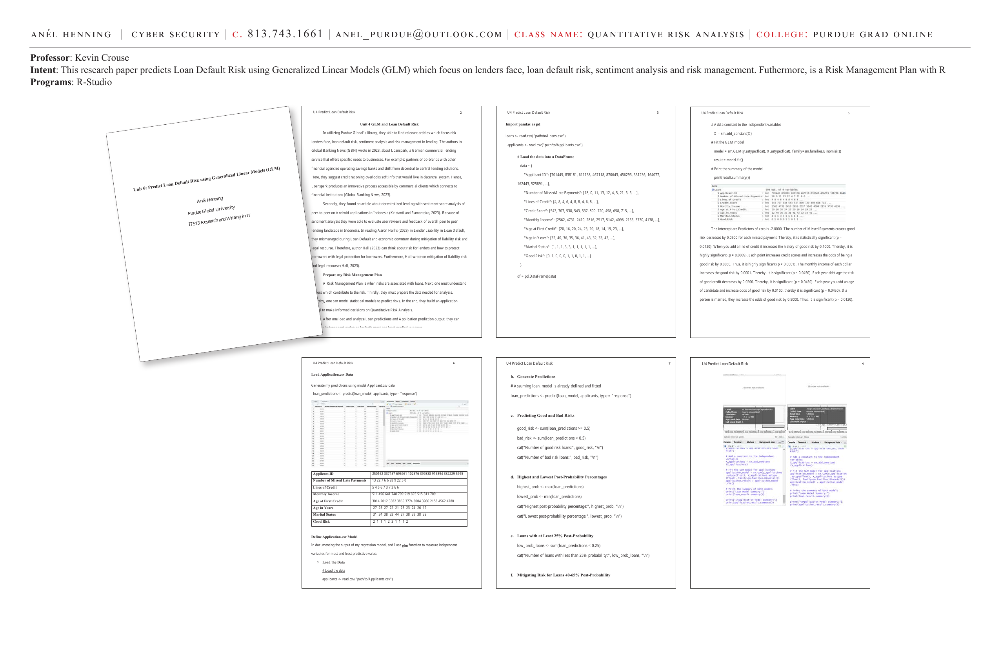
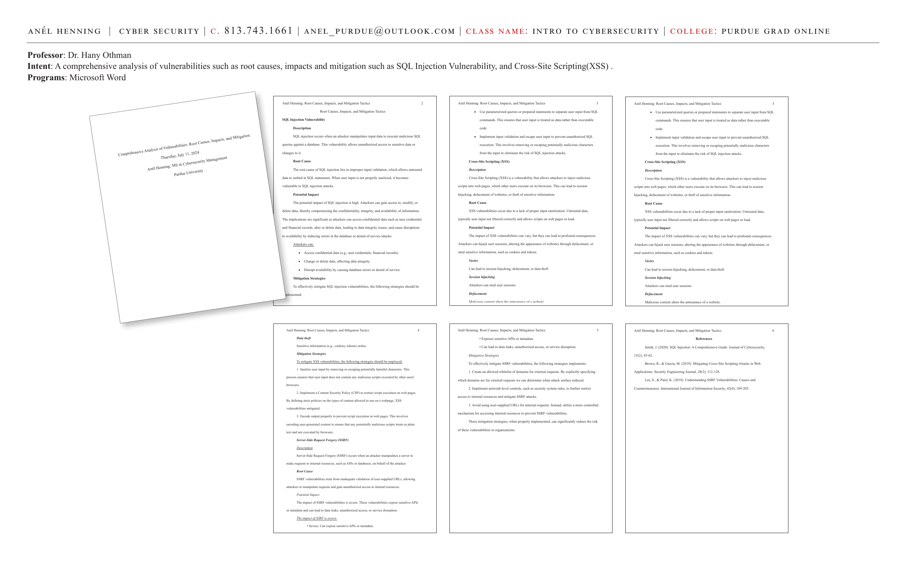
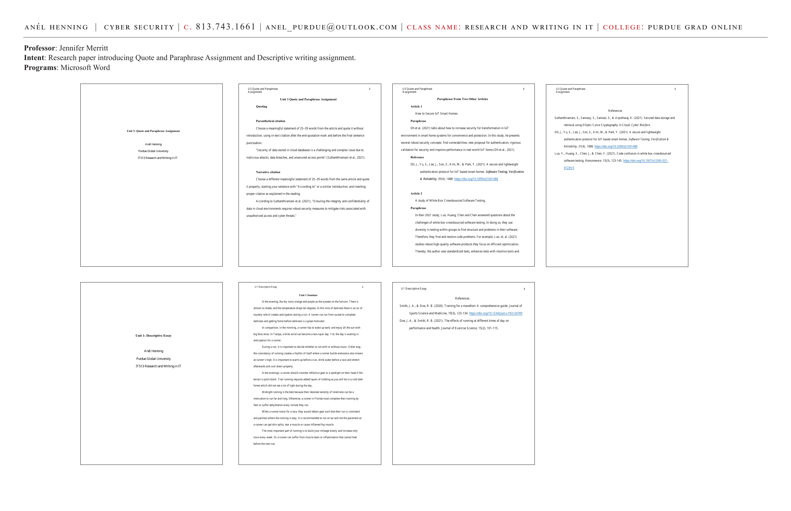

# Unit 6: Predict Loan Default Risk Using Generalized Linear Models (GLM)

**Course:** IT628-01 Quantitative Risk Analysis | Purdue Global University
**Professor:** Kevin Crouse, PhD
**Programs:** R-Studio

**Intent:** This research paper predicts Loan Default Risk using Generalized Linear Models (GLM) — focusing on lenders' risk, loan default risk, sentiment analysis, and risk management. Includes a Risk Management Plan with R.

---





---

## Unit 4 GLM and Loan Default Risk

Using Purdue Global's library, relevant articles were found which focus on risk lenders face, loan default risk, sentiment analysis, and risk management in lending.

**Key Research Sources:**
- Global Banking News (GBN) wrote in 2023 about Loanspark, a German commercial lending service that offers specific needs to businesses — partners or co-brands with other financial agencies operating savings banks and shifts from decentral to central lending solutions.
- Decentralized lending with sentiment score analysis of peer-to-peer on Android applications in Indonesia (Kristanti and Ramantoko, 2023).
- Aaron Hall's (2023) *Lender Liability in Loan Default* — mismanaged during Loan Default and economic downturn during mitigation of liability risk and legal recourse.

---

## Risk Management Plan

A **Risk Management Plan** is when risks are associated with loans:
1. Understand factors which contribute to the risk
2. Prepare the data needed for analysis
3. Model statistical models to predict risks
4. Build an application model to make informed decisions on Quantitative Risk Analysis

---

## Dataset Structure

```python
import pandas as pd

data = {
    "Applicant ID": [701445, 838181, 611138, 467118, 870643, 456293, 331236, 164077, 162443, 525891, ...],
    "Number of Missed/Late Payments": [18, 0, 11, 13, 12, 4, 5, 21, 6, 6, ...],
    "Lines of Credit": [4, 8, 4, 6, 4, 8, 8, 4, 6, 8, ...],
    "Credit Score": [543, 707, 538, 543, 537, 800, 720, 498, 658, 715, ...],
    "Monthly Income": [2562, 4731, 2410, 2816, 2517, 5142, 4098, 2155, 3730, 4138, ...],
    "Age at First Credit": [20, 16, 20, 24, 23, 20, 18, 14, 19, 23, ...],
    "Age in Years": [32, 40, 36, 35, 36, 41, 43, 32, 33, 42, ...],
    "Marital Status": [1, 1, 1, 3, 3, 1, 1, 1, 1, 1, ...],
    "Good Risk": [0, 1, 0, 0, 0, 1, 1, 0, 1, 1, ...]
}

df = pd.DataFrame(data)
```

---

## GLM Model: Fitting the Binomial Model

```python
import statsmodels.api as sm

# Add a constant to the independent variables
X = sm.add_constant(X)

# Fit the GLM model
model = sm.GLM(y.astype(float), X.astype(float), family=sm.families.Binomial())
result = model.fit()

# Print the summary of the model
print(result.summary())
```

---

## Model Interpretation

| Predictor | Coefficient | p-value | Interpretation |
|---|---|---|---|
| Intercept | -2.0000 | — | Predictors of zero = -2.0000 |
| Number of Missed Payments | -0.0500 | 0.0120 | Good risk decreases by 0.0500 for each missed payment — statistically significant |
| Lines of Credit | +0.1000 | 0.0009 | Increases history of good risk by 0.1000 — highly significant |
| Credit Score | +0.0050 | < 0.0001 | Each point increases odds of being a good risk by 0.0050 — highly significant |
| Monthly Income | +0.0001 | 0.0450 | Each dollar increase raises good risk by 0.0001 — significant |
| Debt Age | -0.0200 | 0.0450 | Each year decreases good credit risk by 0.0200 — significant |
| Age | +0.0100 | 0.0450 | Each year adds age of candidate and increases odds of good risk — significant |
| Married | +0.5000 | 0.0120 | Being married increases odds of good risk by 0.5000 — significant |

---

## Applicant.csv Prediction Data

```
Applicant.ID:  250162  337157  696961  102576  399338  916894  332229  5915
Number of Missed Late Payments: 13  22  7  6  6  28  9  22  5  0
Lines of Credit:  5  4  5  6  7  3  7  3  6  6
Monthly Income: 511  496  641  748  799  519  693  515  811  709
Age at First Credit: 3014  2012  3382  3865  3774  3004  3966  2158  4562  4780
Age in Years:  27  25  27  22  21  25  23  24  26  19
Good Risk:  2  1  1  1  2  3  1  1  1  2
```

---

## Prediction Output Code

```r
# Load the data
applicants <- read.csv("path/to/Applicants.csv")

# Generate Predictions
loan_predictions <- predict(loan_model, applicants, type = "response")

# Predicting Good and Bad Risks
good_risk <- sum(loan_predictions >= 0.5)
bad_risk <- sum(loan_predictions < 0.5)
cat("Number of good risk loans:", good_risk, "\n")
cat("Number of bad risk loans:", bad_risk, "\n")

# Highest and Lowest Post-Probability Percentages
highest_prob <- max(loan_predictions)
lowest_prob <- min(loan_predictions)
cat("Highest post-probability percentage:", highest_prob, "\n")
cat("Lowest post-probability percentage:", lowest_prob, "\n")

# Loans with at Least 25% Post-Probability
low_prob_loans <- sum(loan_predictions < 0.25)
cat("Number of loans with less than 25% probability:", low_prob_loans, "\n")
```

---

## References

- Loanspark Launches Co-Branded Lending Service to Disrupt Commercial Lending Industry. (2023). *Global Banking News (GBN).*
- Wegner, D. L. B. (2023). Centralized and decentralized lending: Implications of consolidation in the German banking industry. *International Review of Economics and Finance, 75*, 123–135.
- Kristanti, N., & Ramantoko, G. (2023). Sentiment-Score Analysis of P2P Lending Industry on Android Applications in Indonesia. *ICONNIC*, 91–96. https://doi.org/10.1109/ICONNIC59854.2023.10467273

---

**Skills:** Generalized Linear Models (GLM) · Logistic regression · Loan default risk · Credit score analysis · Binomial family · Python statsmodels · R prediction · Risk management · Sentiment analysis
