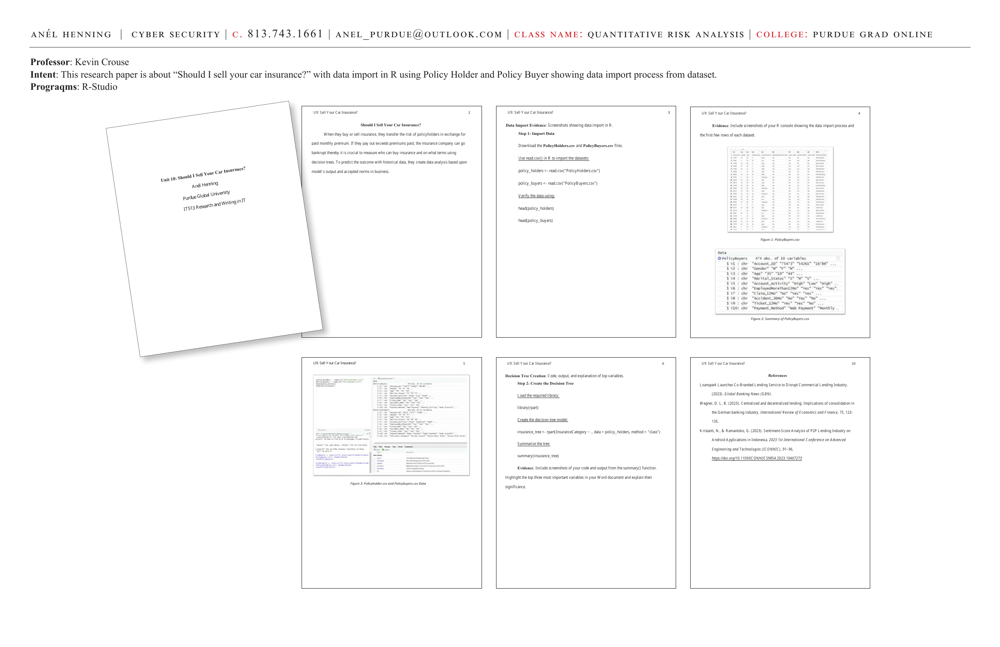
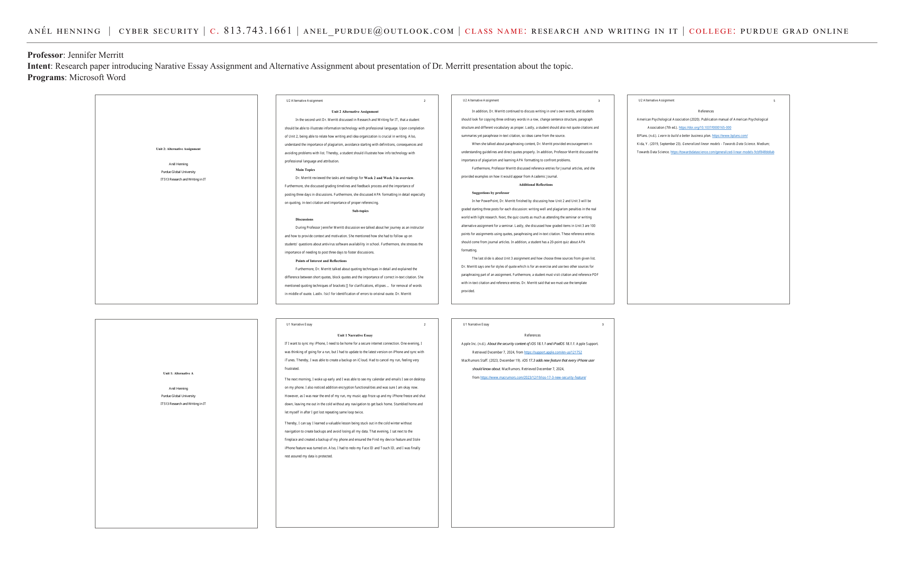

# Unit 9–10: Should I Sell Your Car Insurance? — Decision Tree Analysis

**Course:** IT513 Research and Writing in IT | Purdue Global University
**Professor:** Kevin Crouse, PhD
**Programs:** R-Studio

**Intent:** This research paper is about "Should I Sell Your Car Insurance?" with data import in R using PolicyHolder and PolicyBuyer datasets — showing the data import process and building a decision tree.

---




---

## Should I Sell Your Car Insurance?

When buying or selling insurance, the risk of policyholders is transferred in exchange for a paid monthly premium. If the pay-out exceeds premiums paid, the insurance company can go bankrupt — thereby it is crucial to measure who can buy insurance and on what terms using **decision trees**.

To predict the outcome with historical data, data analysis is created based upon the model's output and accepted norms in business.

---

## Step 1: Import Data

Download the PolicyHolders.csv and PolicyBuyers.csv files. Use `read.csv()` in R to import the datasets:

```r
policy_holders <- read.csv("PolicyHolders.csv")
policy_buyers <- read.csv("PolicyBuyers.csv")

# Verify the data
head(policy_holders)
head(policy_buyers)
```

**Data Summary:**
- PolicyBuyers: 474 observations, 10 variables
- Variables include: Account_ID, Gender, Weight, Height, EmployedMoreThan2Yrs, Claims, Accident_Sme, Ticket_12MO, Payment_Method

```r
$ V2 : chr "Account_ID" "54368" "54788" ...
$ V3 : chr "Gender" "m" "m" ...
$ V4 : chr "Marital_Status" "S" "M" "U" ...
$ V5 : chr "Weight" "h_w" "Yes" ...
$ V6 : chr "EmployedMoreThan2Yrs" "Yes" "Yes" ...
$ V7 : chr "Claims" "No" "No" ...
$ V8 : chr "Client_Same" "No" "Yes" ...
$ V9 : chr "Ticket_12MO" "Yes" "Yes" ...
$ V10: chr "Payment_Method" "web Payment" "Monthly" ...
```

---

## Step 2: Create the Decision Tree

Load the required library:

```r
library(rpart)
```

Create the decision tree model:

```r
insurance_tree <- rpart(InsuranceCategory ~ ., data = policy_holders, method = "class")
```

Summarize the tree:

```r
summary(insurance_tree)
```

**Evidence:** Screenshots of code and output from the `summary()` function. Highlight the **top three most important variables** in the Word document and explain their significance.

---

## Figures

**Figure 1:** PolicyBuyers.csv — Dataset overview with 474 observations and 10 variables.

**Figure 2:** Summary of PolicyBuyers.csv — Structural overview showing data types and first values.

**Figure 3:** Policyholder.csv and Policybuyers.csv Data — Side-by-side comparison of both datasets after successful import.

---

## References

- Loanspark Launches Co-Branded Lending Service to Disrupt Commercial Lending Industry. (2023). *Global Banking News (GBN).*
- Wegner, D. L. B. (2023). Centralized and decentralized lending: Implications of consolidation in the German banking industry. *International Review of Economics and Finance, 75*, 123–135.
- Kristanti, N., & Ramantoko, G. (2023). Sentiment-Score Analysis of P2P Lending Industry on Android Applications in Indonesia. *ICONNIC*, 91–96. https://doi.org/10.1109/ICONNIC59854.2023.10467273

---

**Skills:** Decision trees · rpart library · Insurance risk modeling · Data import R · CSV datasets · Classification models · PolicyHolder analysis · Risk prediction · Variable importance
