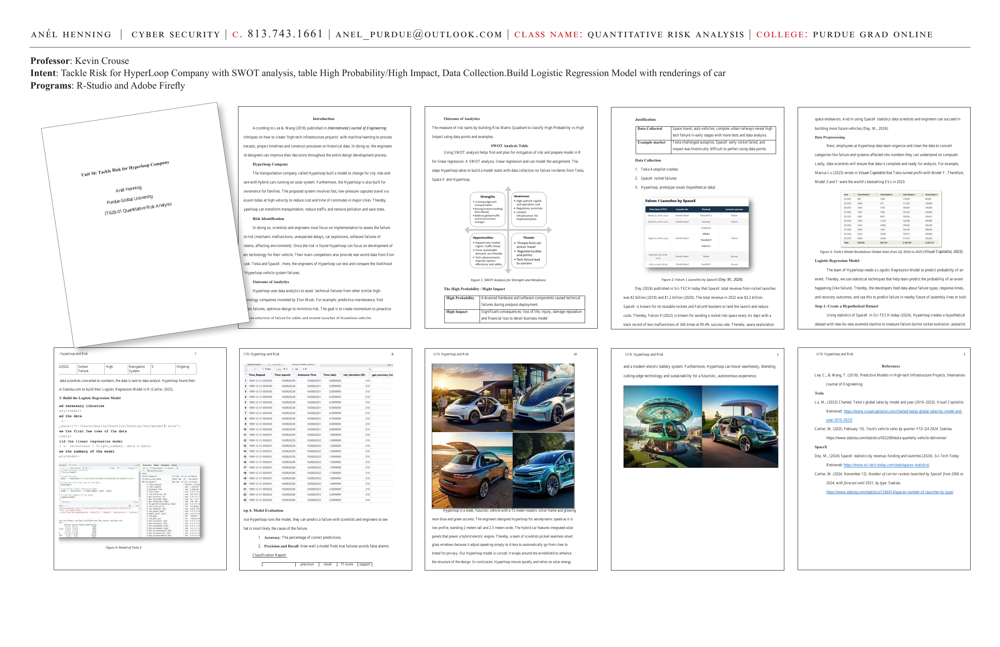
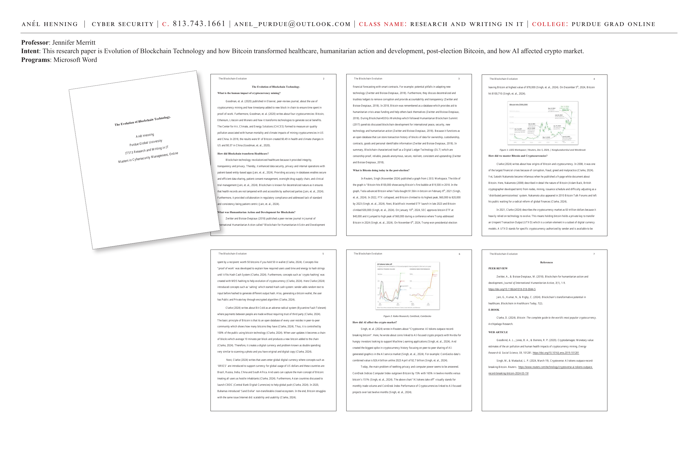
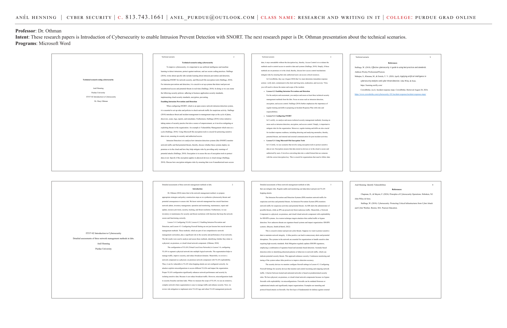

# Unit 10: Tackle Risk for Hyperloop Company

**Course:** IT628-01 Quantitative Risk Analysis | Purdue Global University
**Professor:** Kevin Crouse, PhD
**Programs:** R-Studio, Adobe Firefly

**Intent:** Tackle Risk for Hyperloop Company with SWOT analysis, High Probability/High Impact table, and Data Collection. Build a Logistic Regression Model with AI renderings of the car using Adobe Firefly.

---





---

## Introduction

According to Lee & Wang (2018) published in *International Journal of Engineering*, techniques on how to create "high-tech infrastructure projects" with machine learning to process forecasts, project timelines, and construct processes on historical data. In doing so, engineers and designers can improve their decisions throughout the entire design development process.

---

## Hyperloop Company

The transportation company called **Hyperloop** built a model to change city ride-and-share with hybrid cars running on a solar system. Hyperloop is also built for convenience for families. The proposed system involves fast, low-pressure capsules traveling via vacuum tubes at high velocity to reduce cost and time of commutes in major cities.

**Impact:** Hyperloop can transform transportation, reduce traffic, remove pollution, and save trees.

---

## Risk Identification

Scientists and engineers must focus on implementation to assess failure and risk:
- Mechanic malfunctions
- Unexpected delays
- Car explosions
- Software failures of systems
- Environmental effects

Once the risk is found, Hyperloop can focus on development of their technology. Their main competitors provide real-world data from **Elon Musk: Tesla and SpaceX**.

---

## Outcome of Analytics

Hyperloop uses data analytics to assess technical failures from other similar high-technology companies:
- **Predictive maintenance**
- **Finding system failures**
- **Optimizing design to minimize risk**

The goal is to create momentum to proactively reduce failure for safety and prompt launches of Hyperloop vehicles.

---

## SWOT Analysis

| | |
|---|---|
| **Strengths** | Cutting-edge technology · Solar-powered hybrid · Autonomous systems · Future-forward design |
| **Weaknesses** | High capital costs · Limited infrastructure · Regulatory hurdles |
| **Opportunities** | Expand into market · Reduce traffic burden · Demand for eco-friendly transport · Government funding |
| **Threats** | Threats from high-tech failures · Public safety concerns · Competing transport modes · Regulatory changes |

---

## The High Probability / High Impact Matrix

| | Description |
|---|---|
| **High Probability** | Advanced hardware and software components caused technical failures during pre/post-deployment |
| **High Impact** | Significant consequences: loss of life, injury, damage reputation, and financial loss to derail the business model |

---

## Data Collection

1. **Tesla Autopilot crashes**
2. **SpaceX rocket failures**
3. **Hyperloop prototype issues (hypothetical data)**

**Justification:**

| Category | Detail |
|---|---|
| Data Collected | Space travel, auto vehicles, complex urban railways reveal high-tech failure in early stages — with more tests and data analysis |
| Example market | Tesla challenged autopilot, SpaceX early rocket failed — historically difficult to perfect using data points |

---

## SpaceX Data Reference

Dey (2024) published in *Sci-TECH Today* that SpaceX total revenue from rocket launches was $2 billion (2018) and $1.2 billion (2020). The total revenue in 2022 was $3.2 billion.

**Falcon 9 (2022):** Known for sending a rocket into space every six days with a track record of two malfunctions out of 346 launches — a **99.4% success rate**.

---

## Data Preprocessing

Hyperloop data team organizes and cleans the data to convert categories like failure and systems affected into numbers for computer analysis.

Marcus Lu (2023) wrote in *Visual Capitalist* that Tesla turned profit with Model Y. Model 3 and Y were the world's bestselling EVs in 2023.

---

## Logistic Regression Model

The team of Hyperloop needs a Logistic Regression Model to predict probability of an event — using statistical techniques that help predict the probability of a failure happening. Developers feed data about failure types, response times, and recovery outcomes.

### Step 1: Create a Hypothetical Dataset

Using statistics of SpaceX in Sci-TECH Today (2024), Hyperloop creates a hypothetical dataset measuring failure during rocket explosion autopilot:

```r
# Build the linear regression model
model <- lm(success ~ flight_number, data = data)

# View the summary of the model
summary(model)
```

**Sample Failure Data:**

| Date | Failure | Probability | System | Response Time | Ongoing |
|---|---|---|---|---|---|
| 2/2022 | Sensor Failure | High | Navigation System | 5 | Ongoing |

---

## Step 4: Model Evaluation

Once Hyperloop runs the model, they can predict a failure with scientists and engineers to see what is most likely the cause:

1. **Accuracy:** The percentage of correct predictions.
2. **Precision and Recall:** How well a model finds true failures and avoids false alarms.

**Classification Report:**

| | precision | recall | f1-score | support |
|---|---|---|---|---|
| (space endeavors) | — | — | — | — |

---

## Hyperloop Vehicle Design (Adobe Firefly AI Rendering)

Hyperloop is a sleek, futuristic vehicle with a **12-meter metallic silver frame** and glowing neon blue and green accents.

**Design Specifications:**
- **Height:** 2 meters tall
- **Width:** 2.5 meters wide
- **Profile:** Low profile, aerodynamically designed for speed
- **Windows:** Seamless smart glass — adjust by speaking to Alexa to go from clear to tinted for privacy
- **Power:** Integrated solar panels powering a hybrid electric engine
- **Frame:** Curved, wraps around windshield to enhance structural integrity

> "Hyperloop moves quietly and relies on solar energy and a modern electric battery system. Furthermore, Hyperloop can hover seamlessly, blending cutting-edge technology and sustainability for a futuristic, autonomous experience."

---

## References

- Lee, C., & Wang, T. (2018). Predictive Models in High-tech Infrastructure Projects. *International Journal of Engineering.*
- Lu, M. (2023). Charted: Tesla's global sales by model and year (2016–2023). *Visual Capitalist.* https://www.visualcapitalist.com/charted-teslas-global-sales-by-model-and-year-2016-2023/
- Carlier, M. (2025, February 10). Tesla's vehicle sales by quarter YTD Q4 2024. *Statista.* https://www.statista.com/statistics/502208/tesla-quarterly-vehicle-deliveries/
- Dey, M. (2024). SpaceX statistics by revenue, funding and launches [2024]. *Sci-Tech Today.* https://www.sci-tech-today.com/stats/spacex-statistics/
- Carlier, M. (2024, November 12). Number of carrier rockets launched by SpaceX from 2006 to 2024. *Statista.* https://www.statista.com/statistics/1266914/spacex-number-of-launches-by-type/

---

**Skills:** Logistic regression · SWOT analysis · Risk matrix · Predictive maintenance · SpaceX/Tesla data · R-Studio · Adobe Firefly AI · High probability/high impact analysis · Autonomous vehicle risk modeling · Data preprocessing
